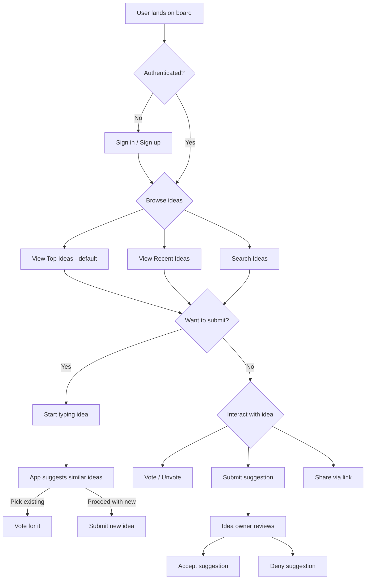

# Ideas Board — Specifications

> **Ideas Board** is a collaborative voting board where workshop participants share ideas, vote on them, and decide what to work on together.

---

## 1. Product Overview

### 1.1 Problem Statement

Workshop facilitators and participants need a simple, democratic way to propose ideas, surface the best ones, and collectively decide which project to pursue. Existing tools (Google Forms, Slack polls) lack real-time collaboration, idea deduplication, and structured voting.

### 1.2 Core Value Proposition

- **Submit** your idea in seconds
- **Discover** similar ideas before submitting (avoid duplicates)
- **Vote** for the ideas you believe in
- **Collaborate** by suggesting improvements to existing ideas
- **Share** ideas across social platforms to gather votes

### 1.3 Key User Flows



---

## 2. Functional Requirements

### 2.1 Ideas

| Feature | Description |
|---|---|
| **Create** | User submits an idea with a title (required) and description (optional, rich text). |
| **Similar suggestions** | While typing the title, the app queries existing ideas and shows a ranked list of similar ones. User can either pick one (redirected to vote/view) or proceed with submission. |
| **View** | Each idea shows: title, description, author name, vote count, creation date, suggestion count. |
| **Vote** | One vote per user per idea. Toggle (vote/unvote). Vote count updates in real-time. |
| **Delete** | Only the idea creator can delete their own idea. Requires confirmation dialog. |
| **Edit** | Only the idea creator can edit title and description. |

### 2.2 Suggestions

| Feature | Description |
|---|---|
| **Submit** | Any user can submit a text suggestion on any idea. |
| **Review** | Only the idea creator sees pending suggestions. They can **accept** or **deny** each. |
| **Accepted** | Accepted suggestions are visible on the idea detail page. |
| **Denied** | Denied suggestions are hidden from public view but remain in the creator's dashboard. |

### 2.3 Sorting & Filtering

| Mode | Description | Default |
|---|---|---|
| **Top** | Sorted by vote count descending | ✅ |
| **Recent** | Sorted by creation date descending | |
| **Search** | Full-text search on idea titles and descriptions | |

### 2.4 Social Sharing

Each idea has a dedicated shareable URL (`/idea/:id`). The page must include:

- **Open Graph** meta tags (`og:title`, `og:description`, `og:image`, `og:url`)
- **Twitter Card** meta tags (`twitter:card`, `twitter:title`, `twitter:description`, `twitter:image`)
- **Auto-generated OG image** per idea (title + vote count rendered as image, or a default branded image)
- **Share buttons**: Copy link, WhatsApp, X (Twitter), Facebook, LinkedIn, Telegram

### 2.5 Authentication (Convex Auth)

Authentication is required for all write actions and is integrated from day one using **Convex Auth** (`@convex-dev/auth`).

- **Sign-in methods** (at launch):
  - OAuth: Google, GitHub
  - Anonymous (guest sign-in for quick access — can later link to OAuth)
- **Auth flow**:
  - Browsing ideas, viewing details, and searching are **public** (no auth required).
  - Voting, submitting ideas, and submitting suggestions require **authentication**.
  - When an unauthenticated user attempts a write action, a sign-in modal appears.
- **User profile**:
  - Display name and avatar sourced from OAuth provider.
  - Stored in Convex `users` table (auto-created by Convex Auth).
- **Session management**: Handled entirely by Convex Auth (JWT-based, no custom session logic).

> [!NOTE]
> Convex Auth manages the `users` and `authSessions` tables automatically. Our schema references `userId` as `v.id("users")`.

---

## 3. Non-Functional Requirements

### 3.1 Performance

- Initial page load < 2s on 3G.
- Real-time updates for votes and new ideas (Convex subscriptions).
- Search results appear within 300ms of typing (debounced).

### 3.2 Accessibility

- Full keyboard navigation.
- ARIA labels on all interactive elements.
- Minimum contrast ratio 4.5:1.

### 3.3 Internationalization (i18n)

- **Languages**: Arabic (ar) and English (en) at launch.
- **Direction**: Full RTL support for Arabic, LTR for English.
- **Routing**: Locale prefix in URL (`/ar/...`, `/en/...`), default locale configurable.
- All UI strings externalized into locale files.
- Date formatting respects locale.

### 3.4 Responsiveness

- Mobile-first design.
- Breakpoints: `sm` (640px), `md` (768px), `lg` (1024px), `xl` (1280px).
- Touch-friendly vote buttons (min 44px tap target).

### 3.5 SEO

- Server-side rendering for all public pages.
- Dynamic meta tags per idea page.
- Sitemap generation.
- Structured data (JSON-LD) for ideas where applicable.

---

## 4. Tech Stack

| Layer | Technology |
|---|---|
| **Framework** | Nuxt 3 (Vue 3 + Composition API) |
| **UI Library** | shadcn-vue (Nuxt module) + Tailwind CSS |
| **Database & Backend** | Convex (real-time, serverless) |
| **Auth** | Convex Auth (`@convex-dev/auth`) — OAuth (Google, GitHub) + Anonymous |
| **Hosting** | Cloudflare Pages |
| **i18n** | `@nuxtjs/i18n` |
| **State** | Convex reactive queries (no extra state library needed) |
| **Icons** | Lucide icons (bundled with shadcn-vue) |
| **Fonts** | Inter (LTR) + IBM Plex Sans Arabic or Noto Sans Arabic (RTL) |

---

## 5. Data Model (Convex)

### 5.1 Auth Tables (Managed by Convex Auth)

Convex Auth automatically manages the following tables — **do not define them manually**:

- `users` — User profiles (name, email, image from OAuth provider)
- `authSessions` — Active sessions
- `authAccounts` — Linked OAuth accounts
- `authRefreshTokens` — Token refresh management
- `authVerificationCodes` — OTP/verification codes
- `authRateLimits` — Rate limiting for auth attempts

### 5.2 Application Tables

```typescript
// convex/schema.ts

import { defineSchema, defineTable } from "convex/server";
import { v } from "convex/values";
import { authTables } from "@convex-dev/auth/server";

export default defineSchema({
  ...authTables,

  ideas: defineTable({
    title: v.string(),
    description: v.optional(v.string()),
    userId: v.id("users"),       // Convex Auth user reference
    voteCount: v.number(),       // denormalized for sorting
    createdAt: v.number(),       // Date.now() timestamp
    updatedAt: v.optional(v.number()),
  })
    .index("by_votes", ["voteCount"])
    .index("by_created", ["createdAt"])
    .index("by_user", ["userId"])
    .searchIndex("search_ideas", {
      searchField: "title",
      filterFields: [],
    }),

  votes: defineTable({
    ideaId: v.id("ideas"),
    userId: v.id("users"),       // Convex Auth user reference
  })
    .index("by_idea", ["ideaId"])
    .index("by_user_idea", ["userId", "ideaId"]),

  suggestions: defineTable({
    ideaId: v.id("ideas"),
    content: v.string(),
    userId: v.id("users"),       // Convex Auth user reference
    status: v.union(
      v.literal("pending"),
      v.literal("accepted"),
      v.literal("denied")
    ),
    createdAt: v.number(),
  })
    .index("by_idea", ["ideaId"])
    .index("by_idea_status", ["ideaId", "status"]),
});
```

### 5.3 Key Queries & Mutations

All mutations use `getAuthUserId(ctx)` from `@convex-dev/auth/server` to identify the current user. Author info (name, avatar) is resolved by joining on the `users` table at query time.

| Function | Type | Auth | Description |
|---|---|---|---|
| `ideas.listTop` | Query | Public | Paginated list sorted by `voteCount` desc |
| `ideas.listRecent` | Query | Public | Paginated list sorted by `createdAt` desc |
| `ideas.search` | Query | Public | Full-text search using Convex search index |
| `ideas.getById` | Query | Public | Single idea by ID (with author info joined) |
| `ideas.create` | Mutation | Required | Create new idea (sets `userId` from session) |
| `ideas.update` | Mutation | Required | Edit idea (creator only — checks `userId`) |
| `ideas.remove` | Mutation | Required | Delete idea (creator only) |
| `votes.toggle` | Mutation | Required | Vote or unvote; updates `ideas.voteCount` |
| `votes.hasVoted` | Query | Required | Check if current user voted for an idea |
| `suggestions.create` | Mutation | Required | Submit suggestion on an idea |
| `suggestions.listByIdea` | Query | Public | Get suggestions for idea (filtered by status) |
| `suggestions.updateStatus` | Mutation | Required | Accept/deny (creator of parent idea only) |
| `auth.currentUser` | Query | Required | Get current authenticated user profile |

---

## 6. Page Structure

```
/                         → Redirect to /{locale}
/{locale}                 → Idea board (Top / Recent / Search) — THE main page
/{locale}/idea/:id        → Idea detail (description, suggestions, share)
/{locale}/idea/:id/share  → OG image endpoint (auto-generated)
/{locale}/auth/sign-in    → Sign-in page (OAuth buttons)
```

> [!NOTE]
> There is no separate "home" or "landing" page. The idea board IS the root page. Users land directly on the list of ideas.

### 6.1 Idea Board (`/{locale}`) — Root Page

- **Header**: App name/logo, language toggle (AR/EN), dark mode toggle, user avatar/sign-in button.
- **Submit CTA**: Prominent "Share your idea" button at top. If user is not authenticated, clicking triggers sign-in modal.
- **Tabs/Toggle**: "Top" (default) | "Recent".
- **Search bar**: Inline, always visible.
- **Idea cards grid**: Responsive grid of idea cards.
  - Each card: title (truncated), vote count + vote button, author avatar + name, time ago, suggestion count badge.
- **Infinite scroll** or "Load more" button.

### 6.2 Idea Detail (`/{locale}/idea/:id`)

- Full title and description.
- Vote button + count.
- Share buttons (social + copy link).
- Author info (avatar, name).
- Suggestions section:
  - If viewer is the creator: pending/accepted/denied tabs.
  - If viewer is not the creator: accepted suggestions only + "Suggest improvement" input.
- Back to board link.

### 6.3 Submit Flow (Modal/Drawer)

1. User clicks "Share your idea" → if not authenticated, sign-in modal appears first.
2. Once authenticated, submit modal/drawer opens.
3. User types title → after 3+ characters, similar ideas appear below in real time.
4. Similar ideas list: each shows title, vote count, "Vote for this" button.
5. User either picks a similar idea or clicks "Submit my idea".
6. If submitting: optional description field appears → submit button.

### 6.4 Authentication UI

- **Sign-in modal**: Triggered contextually (on vote, submit, suggest) — not a separate page navigation.
- **OAuth buttons**: "Continue with Google", "Continue with GitHub".
- **Guest option**: "Continue as Guest" for anonymous quick access.
- **User menu** (when authenticated): Avatar dropdown with sign-out option.

---

## 7. Design System

### 7.1 Visual Direction

- **Clean & minimal** — whitespace-heavy, card-based layout.
- **Brand colors**: A warm primary (e.g., amber/orange gradient) to evoke creativity and energy.
- **Dark mode**: Support from day one using Tailwind's `dark:` utilities and shadcn-vue theming.
- **Micro-animations**: Vote count increment (spring animation), card entrance (fade-up), modal/drawer (slide-in).

### 7.2 Key Components (shadcn-vue)

| Component | Usage |
|---|---|
| `Card` | Idea cards on the board |
| `Button` | Vote, submit, share actions |
| `Dialog` / `Drawer` | Submit idea flow |
| `Input` / `Textarea` | Idea title, description, suggestion |
| `Tabs` | Top / Recent toggle; Suggestion status tabs |
| `Badge` | Suggestion count, status labels |
| `Tooltip` | Vote button hint, share options |
| `DropdownMenu` | Share menu, idea actions (edit/delete) |
| `Avatar` | Author initials |
| `Skeleton` | Loading states |
| `Sonner (Toast)` | Success/error notifications |

---

## 8. Error Handling

| Scenario | Behavior |
|---|---|
| Network offline | Show toast: "You're offline. Changes will sync when connected." (Convex handles optimistic updates) |
| Idea not found | 404 page with "Idea not found" message and link back to board |
| Duplicate vote attempt | Gracefully toggle — UI should never show double-vote state |
| Empty search results | Friendly empty state: "No ideas match your search. Try different keywords." |
| Submission failure | Toast with retry option |

---

## 9. Future Considerations (Out of Scope for MVP)

- Additional OAuth providers (Apple, Microsoft).
- Magic link / email OTP sign-in.
- Commenting threads on ideas.
- Categories / tags for ideas.
- Workshop management (create boards, invite participants, set deadlines).
- Voting deadlines / rounds.
- Admin dashboard with analytics.
- Email notifications.
- Export results to PDF/CSV.
- Account linking (merge guest account with OAuth).
